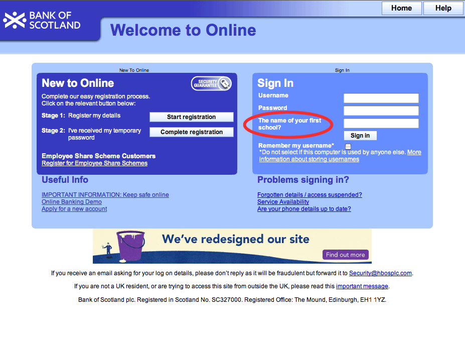

!SLIDE small

##LOGGING IN

    $ bankjob --scraper-args "username password"

!SLIDE smaller

    @@@ruby
    post '/' do
      @question = random_question
      erb authenticate? ? :welcome : :form
    end

    get '/' do
      @question = random_question
      erb :form
    end

    def random_question
      [ "What is your mother's name",
        "What is your father's name",
        "Where were you born" ].sort_by{rand}.first
    end

    def authenticate?
      params[:Username] == "drewneil" and 
      params[:password] == "secret" and 
      ["mummy", "daddy", "hospital"].include?(params[:answer])
    end

!SLIDE center

!SLIDE commandline incremental

    $ bankjob --scraper=hbos_scraper
    username: 
    $ drewneil
    password: 
    $ ••••••
    What is the airspeed velocity of an unladen swallow?: 
    $ •••••

!SLIDE smaller

# HIGHLINE #

    @@@ruby
    require 'rubygems'
    require 'highline/import'

    username = ask("username: ") { |q| q.validate = /\w{5,10}/ }
    password = ask("password: ") { |q| q.echo '•' }

!SLIDE smaller

    @@@ruby
    def login(agent)
      login_page = agent.get(LOGIN_URL)
      form  = login_page.form('frmFormsLogin')

      form.Username = ask("username:\n")
      form.password = ask("password:\n") { |q| q.echo = "•" }

      prompts = agent.page.search(".LoginPrompt")
      if question = prompts[2].inner_html.strip rescue nil
        form.answer          = ask(question){ |q| q.echo = "•" }
      end

      agent.submit(form)
    end

