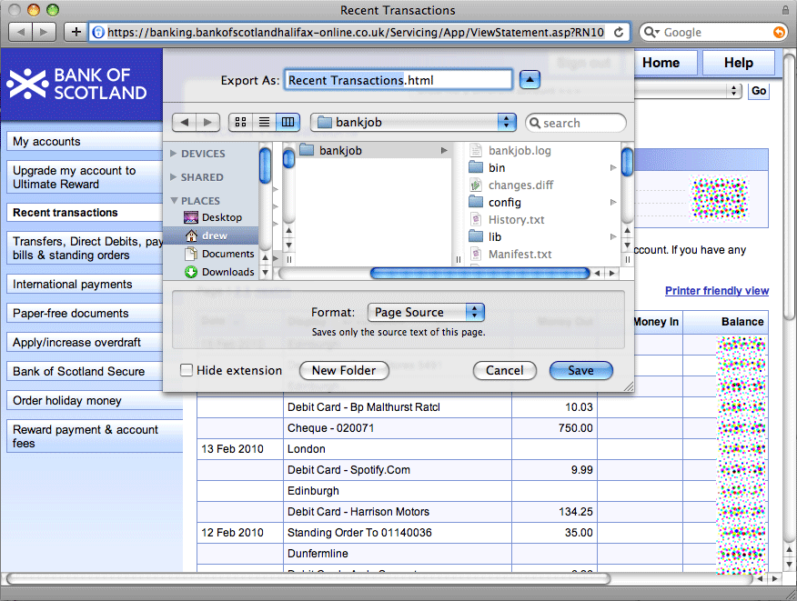

!SLIDE center

!SLIDE commandline

    $ bankjob --input=/path/to/saved/statement.html

!SLIDE smaller

    @@@ruby
    def parse_transactions_page(document)
      returning(create_statement) do |statement|
        table_rows = (document/"#frmStatement table tr")
        table_rows.each_with_index do |row, index|
          next if index == 0 # first row is just headers
          # build transaction
          # ...[next slide]...
          statement.transactions << transaction
        end
      end
    end

!SLIDE smaller

    @@@ruby
    data = (row/"td").collect{ |cell| 
      cell.inner_html.strip.gsub(/&nbsp;/, "")
    }
    
    Struct.new("Line", :date, :description, 
                       :money_out, :money_in, :balance)
    
    current_line = Struct::Line.new(*data)

    amount = current_line.money_out.blank? ?
      current_line.money_in :
      "-" + current_line.money_out

    transaction = create_transaction
    transaction.date            = current_line.date
    transaction.raw_description = current_line.description
    transaction.amount          = amount
    transaction.new_balance     = current_line.balance
    statement.transactions << transaction
    